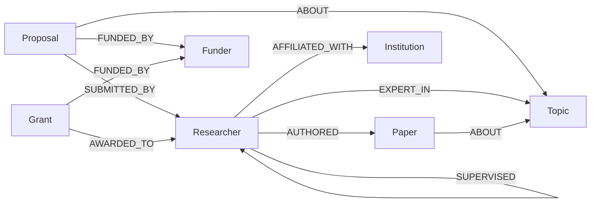
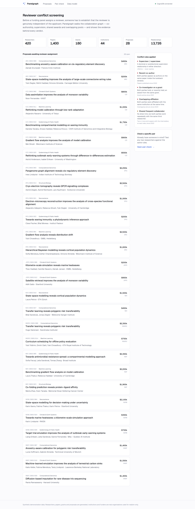
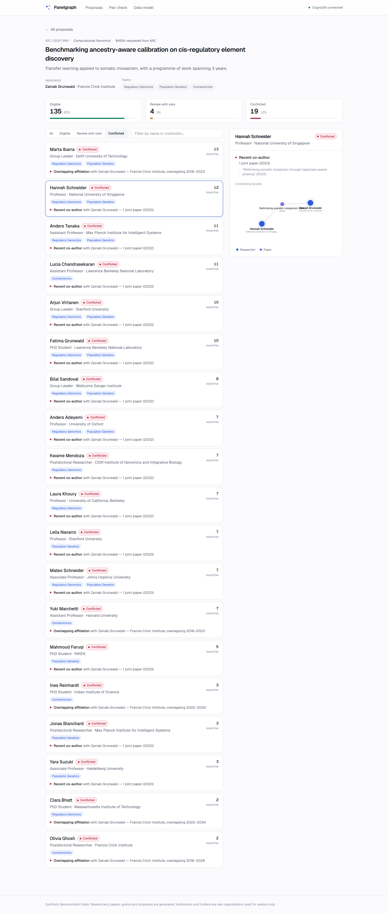
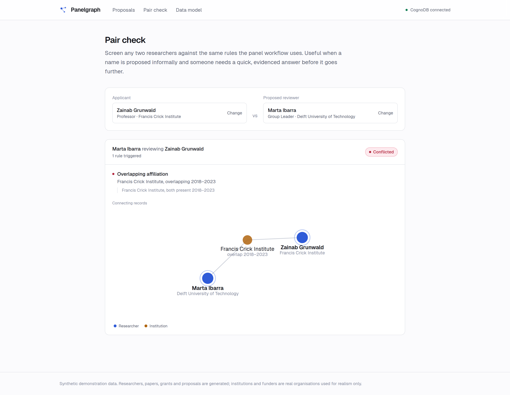
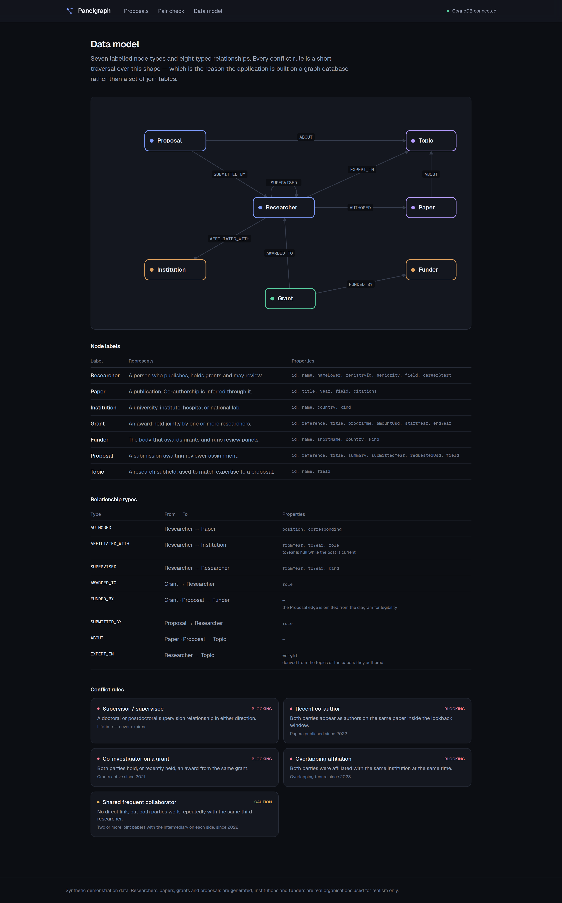

# Panelgraph

**Reviewer conflict-of-interest screening for research funding panels, built on CognoDB.**

Before a funding body sends a proposal out for peer review, someone has to
establish that each proposed reviewer is genuinely independent of the
applicants. Panelgraph answers that question by traversing the collaboration
graph — co-authorship, doctoral supervision, shared awards and overlapping
institutional posts — and shows the evidence behind every verdict.

- **Live demo:** **[wexa-assessment.vercel.app](https://wexa-assessment.vercel.app)** — running against a live CognoDB free-tier instance
- **Screen recording:** **[docs/demo.mp4](docs/demo.mp4)** — a 77-second walkthrough of the hosted app (click to play on GitHub)

The recording covers: the proposal queue → screening a proposal into eligible /
review-with-care / conflicted → the evidence behind a blocking conflict → the
softer second-degree signal → an ad-hoc pair check → the data model.


---

## Contents

1. [The problem](#the-problem)
2. [Why a graph database?](#why-a-graph-database)
3. [Data model](#data-model)
4. [The conflict rules](#the-conflict-rules)
5. [The main queries](#the-main-queries)
6. [Screens](#screens)
7. [Running it](#running-it)
8. [Project structure](#project-structure)
9. [Engineering notes](#engineering-notes)
10. [Notes on CognoDB](#notes-on-cognodb)
11. [About the data](#about-the-data)

---

## The problem

A grant proposal arrives. A programme officer needs three reviewers who are
expert in its topics and independent of its applicants. "Independent" is
defined by policy, and real policies (the NSF's conflict-of-interest rules, the
ERC's independence criteria) all say roughly the same thing: no recent
co-authorship, no supervision relationship, no shared funding, no shared
employer.

Checking this by hand is slow and unreliable. The connections that matter are
rarely on anyone's CV — they are spread across publication records, grant
registries and employment histories, and the awkward ones are indirect.

Panelgraph does three things:

1. Builds a **candidate pool** from researchers whose publication record shows
   expertise in the proposal's topics.
2. Screens each candidate against **five conflict rules**, returning a verdict
   of *eligible*, *review with care*, or *conflicted*.
3. Shows the **specific records** behind each verdict — the actual papers,
   grants and posts — rendered as the subgraph connecting the two people.

The third point is the one that matters in practice. A panel chair who wants to
overrule a flag needs to see the evidence, not a score.

---

## Why a graph database?

The application's central question is *"is there any chain of association
between these two people, and what is it?"* That is a question about paths, not
about rows, and it is where a relational schema starts to fight back.

### The relationships are the data

Storing this relationally is easy — `researcher`, `paper`, `authorship`,
`grant`, `grant_award`, `affiliation` are all unremarkable tables. Querying it
is where the difficulty appears, because every conflict rule is a *different
shape of join*, and the interesting ones are self-joins through junction
tables.

Take the hardest rule Panelgraph implements: two researchers who both publish
repeatedly with the same third person. In SQL:

```sql
WITH applicant_bridges AS (
    SELECT  a2.researcher_id           AS bridge_id,
            COUNT(DISTINCT p.id)       AS joint_papers
    FROM    authorship a1
    JOIN    paper      p  ON p.id = a1.paper_id AND p.year >= :since
    JOIN    authorship a2 ON a2.paper_id = p.id
                         AND a2.researcher_id <> a1.researcher_id
    WHERE   a1.researcher_id = :applicant_id
    GROUP BY a2.researcher_id
    HAVING  COUNT(DISTINCT p.id) >= 2
),
candidate_bridges AS (
    SELECT  a4.researcher_id     AS candidate_id,
            ab.bridge_id,
            COUNT(DISTINCT p2.id) AS joint_papers
    FROM    applicant_bridges ab
    JOIN    authorship a3 ON a3.researcher_id = ab.bridge_id
    JOIN    paper      p2 ON p2.id = a3.paper_id AND p2.year >= :since
    JOIN    authorship a4 ON a4.paper_id = p2.id
                         AND a4.researcher_id <> ab.bridge_id
    GROUP BY a4.researcher_id, ab.bridge_id
    HAVING  COUNT(DISTINCT p2.id) >= 2
)
SELECT candidate_id, bridge_id FROM candidate_bridges;
```

Four joins across two junction tables, two `GROUP BY … HAVING` stages, and two
CTEs — and the hop count is welded into the query text. The same rule in
Cypher:

```cypher
MATCH (applicant)-[:AUTHORED]->(p1:Paper)<-[:AUTHORED]-(bridge:Researcher)
WHERE p1.year >= $since AND bridge <> applicant
WITH applicant, bridge, count(DISTINCT p1) AS jointWithApplicant
WHERE jointWithApplicant >= $minJoint

MATCH (bridge)-[:AUTHORED]->(p2:Paper)<-[:AUTHORED]-(candidate:Researcher)
WHERE p2.year >= $since AND candidate <> bridge
WITH bridge, candidate, count(DISTINCT p2) AS jointWithCandidate
WHERE jointWithCandidate >= $minJoint
RETURN candidate, bridge
```

The Cypher reads in the same order as the sentence describing the rule. That is
not a cosmetic difference — it is the difference between a rule a policy owner
can review and one only its author understands.

### Depth is a parameter, not a rewrite

The SQL above finds bridges at exactly one intermediate hop. Extending it to
two would mean another CTE layer and another pair of joins. In Cypher, a
variable-length pattern (`-[:AUTHORED*1..6]-`) changes the reach without
changing the query's structure. Conflict policies do get revised; a data model
where "one more hop" is a parameter rather than a rewrite is worth having.

### Heterogeneous paths in one traversal

The rules span four different relationship types. Cypher can traverse them
together — `-[:AUTHORED|AFFILIATED_WITH|AWARDED_TO*1..3]-` — and return the
path that matched. In SQL each type is a different table with a different join
key, so a combined "any association within three hops" query means unioning
several structurally different join trees and then working out which branch
produced each row.

### The answer is the path

The screening result is not a boolean; it is *evidence*. Cypher returns the
matched nodes and relationships directly, so the application renders the actual
papers and posts that triggered the flag. Recovering that from a relational
result set means threading identifiers of every joined row back through the
query and reassembling them in application code — the graph gives it up for
free, and it is what the drill-down panel and the evidence diagram are built
from.

### Where a relational database would be fine

Honesty matters here: this dataset is small, and Postgres with a recursive CTE
would run it perfectly well. The argument for a graph database is not
performance at this scale — it is that the queries stay legible, the traversal
depth stays configurable, and the evidence path comes back with the answer. If
this system grew to a national research registry with tens of millions of
authorships, the traversal advantage would start to matter on its own terms;
at demo scale, expressiveness is the honest justification.

---

## Data model

Seven labelled node types and eight typed relationships.



### Nodes

| Label | Represents | Properties |
| --- | --- | --- |
| `Researcher` | A person who publishes, holds grants and may review | `id`, `name`, `nameLower`, `registryId`, `seniority`, `field`, `careerStart` |
| `Paper` | A publication; co-authorship is inferred through it | `id`, `title`, `year`, `field`, `citations` |
| `Institution` | University, institute, hospital or national lab | `id`, `name`, `country`, `kind` |
| `Grant` | An award held jointly by one or more researchers | `id`, `reference`, `title`, `programme`, `amountUsd`, `startYear`, `endYear` |
| `Funder` | The body that awards grants and runs panels | `id`, `name`, `shortName`, `country`, `kind` |
| `Proposal` | A submission awaiting reviewer assignment | `id`, `reference`, `title`, `summary`, `submittedYear`, `requestedUsd`, `field` |
| `Topic` | A research subfield, used to match expertise | `id`, `name`, `field` |

### Relationships

| Type | From → To | Properties |
| --- | --- | --- |
| `AUTHORED` | `Researcher` → `Paper` | `position`, `corresponding` |
| `AFFILIATED_WITH` | `Researcher` → `Institution` | `fromYear`, `toYear`, `role` |
| `SUPERVISED` | `Researcher` → `Researcher` | `fromYear`, `toYear`, `kind` |
| `AWARDED_TO` | `Grant` → `Researcher` | `role` |
| `FUNDED_BY` | `Grant`, `Proposal` → `Funder` | — |
| `SUBMITTED_BY` | `Proposal` → `Researcher` | `role` |
| `ABOUT` | `Paper`, `Proposal` → `Topic` | — |
| `EXPERT_IN` | `Researcher` → `Topic` | `weight` |

Two modelling decisions carry most of the weight:

**Affiliation is time-bounded on the relationship.** `AFFILIATED_WITH` carries
`fromYear` and `toYear` (null while current), so "were these two people ever at
the same place at the same time?" is an interval-overlap predicate on two
relationship properties rather than a question about the nodes. Modelling
affiliation as a property of `Researcher` would have made the rule impossible
to express without losing history.

**Expertise is derived, not declared.** `EXPERT_IN` is computed by the seed
script from the topics of the papers a researcher actually authored, with
`weight` counting them. Candidate pools are therefore grounded in publication
record rather than self-reported keywords.

### Constraints and indexes

Uniqueness constraints on `id` for every label — these double as lookup indexes
and keep the seed script's `MERGE` statements from degrading into full scans.
Plus three range indexes for the hot predicates: `Researcher.nameLower` for
search, `Paper.year` and `Grant.endYear` for the conflict lookback windows.

---

## The conflict rules

| Rule | Severity | Window |
| --- | --- | --- |
| Supervisor / supervisee | blocking | Lifetime |
| Recent co-author | blocking | Papers since 2022 |
| Co-investigator on a grant | blocking | Grants active since 2021 |
| Overlapping affiliation | blocking | Overlapping tenure since 2023 |
| Shared frequent collaborator | caution | ≥2 joint papers on each side, since 2022 |

### A note on the second-degree rule

The last rule was originally "any shared co-author", which is the obvious
definition. On this dataset it flags **60% of the candidate pool** and leaves
**16 of 28 proposals with no eligible reviewer at all** — academic
co-authorship is a small world, and at two hops nearly everyone is connected to
nearly everyone.

Requiring the intermediary to be a *frequent* collaborator of both parties
(≥2 joint papers on each side) drops that to **8%**, and every proposal retains
a workable pool:

| Definition | Blocked | Caution | Eligible | Proposals with no eligible reviewer |
| --- | --- | --- | --- | --- |
| Any shared co-author | 37% | 60% | 2% | 16 / 28 |
| ≥2 joint papers each side | 37% | 8% | 55% | 0 / 28 |

This is the kind of threshold that only shows up once you run the rule against
realistic data, and it is why the seed generator uses preferential attachment
rather than uniform random edges — uniform edges would have made every
candidate equidistant from every applicant and hidden the problem entirely.

---

## The main queries

All Cypher lives in [`src/lib/queries/`](src/lib/queries). Every statement is a
module-level constant with values supplied as driver parameters; no query text
is ever assembled from user input.

### 1. Reviewer screening — multi-hop, four rules in one pass

[`src/lib/queries/screening.ts`](src/lib/queries/screening.ts) → `SCREEN_CANDIDATES`

Builds the candidate pool from topic expertise, then attaches each blocking
rule as an independent `OPTIONAL MATCH`. Every rule is at least a two-hop
traversal — co-authorship goes `Researcher → Paper ← Researcher`, shared grants
go `Researcher ← Grant → Researcher`, shared institutions go
`Researcher → Institution ← Researcher` with an interval-overlap predicate on
both relationships.

Using `OPTIONAL MATCH` rather than `MATCH` is the point: a candidate with no
conflicts survives to the end of the pipeline with empty collections instead of
being filtered out, and those are exactly the rows the user is looking for.

### 2. Second-degree conflicts — the query SQL finds awkward

[`src/lib/queries/screening.ts`](src/lib/queries/screening.ts) → `SECOND_DEGREE`

The four-hop pattern described in [Why a graph database?](#why-a-graph-database).
Anchored on the applicants rather than the candidates: a proposal has one to
three applicants, so walking outwards from them touches a few hundred nodes,
whereas running the same pattern from each of ~150 candidates would explore the
same paths many times over.

### 3. Pairwise explanation — evidence for the drill-down

[`src/lib/queries/explain.ts`](src/lib/queries/explain.ts) → `PAIR_EVIDENCE`

Given one applicant and one candidate, returns the specific papers, grants,
posts and supervision records connecting them. This is what the evidence
diagram is drawn from.

### 4. Proposal listing

[`src/lib/queries/proposals.ts`](src/lib/queries/proposals.ts) → `PROPOSALS`

One statement serves both the list and the detail view — passing `null` for
`$proposalId` returns every proposal — so there is a single definition of the
shape and no code path that concatenates Cypher.

---

## Screens

**Proposals awaiting reviewer assignment** — the entry point, with the conflict
rules stated in plain language alongside.



**The evidence drill-down** — selecting a flagged reviewer shows the records
behind the verdict and the subgraph that connects them to the applicant.



**Pair check** — screen any two researchers ad hoc against the same rules.



**A guided walkthrough** runs the first time someone opens a proposal, pointing
at each part of the screening view and explaining what it does. It marks itself
complete in `localStorage` and never interrupts again; the **Tour** button in
the header replays it on demand. The completion flag is versioned
(`panelgraph.tour.v1`), so rewriting the steps later shows them again to people
who only saw the old ones.

It is hand-rolled rather than pulled from a tour library — about 180 lines in
[`src/components/tour.tsx`](src/components/tour.tsx), no dependency, and it
inherits the app's design tokens so it matches in light and dark. Steps anchor
to `data-tour` attributes rather than CSS classes or DOM position, and the tour
declines to start at all if any anchor is missing, so a proposal with no
reviewers or an unreachable database never produces a spotlight over empty
space.

**Data model reference**, in the app as well as this README (shown in dark
mode — the whole interface follows the system colour scheme).



---

## Running it

### 1. Create a CognoDB instance

1. Sign up at [console.cognodb.com/signup](https://console.cognodb.com/signup).
   The free tier needs no credit card.
2. Create a free **c0** instance and pick a region. It provisions in under a
   minute.
3. Copy the connection URI (`bolt+s://<instance-id>.databases.cognodb.com`)
   and the generated password for the `cognodb` user. **The password is shown
   exactly once** — save it immediately.

### 2. Configure the app

```bash
cp .env.example .env.local
```

Fill in `COGNODB_URI` and `COGNODB_PASSWORD`. `.env.local` is gitignored;
credentials are never committed.

### 3. Install and verify

```bash
npm install
npm run check-db
```

`check-db` verifies connectivity, confirms write access, and probes which
Cypher features the instance supports before you depend on them.

### 4. Seed the graph

```bash
npm run seed
```

Generates and loads roughly **2,100 nodes and 13,700 relationships** — 420
researchers, 1,400 papers, 180 grants, 44 institutions, 15 funders and 28
proposals awaiting review. The generator is seeded, so the output is identical
on every run; pass `--keep-existing` to load without clearing first.

### 5. Run

```bash
npm run dev
```

Open [localhost:3000](http://localhost:3000).

### Other commands

| Command | Purpose |
| --- | --- |
| `npm run build` | Production build (needs no database) |
| `npm run typecheck` | `tsc --noEmit` |
| `npm run lint` | ESLint |

---

## Project structure

```
scripts/
  check-db.ts           Connectivity + Cypher feature probe
  seed/
    index.ts            Batched, parameterised loader
    generate.ts         Deterministic world generator
    reference-data.ts   Real institutions and funders; synthetic name pools
    random.ts           Seeded PRNG and sampling helpers
    schema.ts           Constraints and indexes

src/
  lib/
    env.ts              Lazy, non-throwing environment parsing (zod)
    neo4j.ts            Driver singleton, error translation, read/write helpers
    domain.ts           Conflict rules and windows — one source of truth
    types.ts            DTOs shared by the query layer, API and UI
    api.ts              Route-handler wrapper and error envelope
    server-data.ts      Server Component loader that degrades gracefully
    queries/            All Cypher
  app/
    page.tsx            Proposal list
    proposals/[id]/     Screening workspace
    check/              Ad-hoc pair check
    model/              Data model reference
    api/                Route handlers
  components/           UI
```

The layering is deliberate: **Cypher only appears in `src/lib/queries/`**. Route
handlers and Server Components call typed functions; no component knows what a
Bolt session is.

---

## Engineering notes

**Credentials.** Read from environment variables only, parsed lazily through a
zod schema that never throws at import time — a missing password surfaces as a
readable "not configured" screen at request time rather than crashing a build
on a machine that has no credentials. `.env*` is gitignored except
`.env.example`.

**Connection pooling.** One driver per process, cached on `globalThis`. The
driver owns a TCP pool, so creating one per request would exhaust the free
tier's 200-connection budget immediately; caching on `globalThis` also survives
Next.js dev hot-reloads, which otherwise leak a pool on every file save. The
pool is capped at 10 connections per process because serverless means many
concurrent instances.

**Parameterisation.** Every query is a module-level constant. Values always
travel as driver parameters, including in the seed script, which writes through
`UNWIND $rows` — so the statement text is constant across batches, the server
caches one plan, and no value is ever interpolated into Cypher.

**Portability.** CognoDB implements openCypher, which overlaps with but is not
identical to Neo4j's dialect. The queries deliberately avoid Neo4j extensions —
no pattern comprehensions, no `CALL {}` subqueries, no `startNode()` — in favour
of `OPTIONAL MATCH` and sequential aggregation. `npm run check-db` probes the
instance for each of these and reports what it supports. (As it happens this
instance supports all of them; the queries stay portable anyway.)

**Read latency.** Reads use auto-commit statements rather than
`session.executeRead()`. A managed read transaction costs three extra network
round trips to buy automatic retries, which at this instance's ~280 ms RTT
meant 600 ms of pure overhead on every query — `RETURN 1` measured 866 ms
managed against 270 ms auto-commit. These reads are idempotent, so `runRead`
retries transient failures itself in a short loop. Writes still go through
`executeWrite`, where the transactional guarantees actually matter. Combined
with issuing the screening page's three statements concurrently instead of
sequentially, this took the screening endpoint from 3.7 s to 1.2 s.

**Error handling.** Driver failures are translated into named types
(`ConfigurationError`, `DatabaseUnavailableError`) and then into a typed API
envelope with a `kind` the UI switches on. "Not configured" and "instance
unreachable" render as different screens with different remedies, because
telling someone the wrong one costs them an afternoon. Every page renders a real
explanation when the database is down; none of them 500.

**Integers.** The driver is configured with `disableLosslessIntegers`, so counts
and years arrive as plain JS numbers and results serialise straight to JSON
without a conversion pass.

---

## Notes on CognoDB

Two behaviours of this CognoDB instance differ from standard Cypher semantics
in ways that produced silently wrong results rather than errors. Both are
reproduced by `npm run check-db`, which builds a three-node fixture and asserts
the expected answer, so they can be re-checked against any instance.

**1. An already-bound variable inside `OPTIONAL MATCH` is rebound, not filtered.**

```cypher
MATCH (a:Researcher {id: 'probe-a'})
MATCH (c:Researcher {id: 'probe-c'})
OPTIONAL MATCH (a)-[r:SUPERVISED]->(c)   -- expected: filter on c
RETURN c.id, r                            -- actual:   c is overwritten
```

Standard Cypher treats `c` here as a constraint — the pattern matches only if
that specific relationship exists. This instance instead matches whoever `a`
supervised and rebinds `c` to them.

**2. In a single-hop `OPTIONAL MATCH`, an id predicate against a parameter is
not applied.**

```cypher
OPTIONAL MATCH (a)-[r:SUPERVISED]->(x:Researcher)
WHERE x.id = $target     -- ignored; the same is true of {id: $target} inline
```

The identical predicate written against a *bound node's property*
(`WHERE x.id = c.id`) is applied correctly, as are parameter predicates on
other properties — the year windows throughout the app work fine — and
multi-hop patterns are unaffected.

**Symptom and fix.** Together these made the pairwise explanation report that
every candidate reviewer shared the applicant's supervision record: the
supervision `OPTIONAL MATCH` ignored its filter and overwrote the candidate. It
returned HTTP 200 with confident, wrong output, which is the failure mode worth
worrying about.

The fix is a rule applied throughout
[`explain.ts`](src/lib/queries/explain.ts): never name an already-bound
variable inside an `OPTIONAL MATCH` pattern, and pin the endpoint with
`= candidate.id` rather than `= $candidateId`. That is correct on any engine
and costs nothing.

**How it was caught.** The conflict logic was independently simulated in
TypeScript over the generated dataset before any Cypher was written, so there
was a second opinion to check against. The screening query agreed with it
exactly; the explanation query did not. A cross-validation script then compared
both queries across 70 reviewer/proposal pairs spanning all three verdicts, and
they now agree on every one.

---

## About the data

Institutions and funders are **real public organisations**, which is what makes
the roster feel like a real panel.

Researchers, papers, grants and proposals are **entirely synthetic**. This is a
deliberate choice, not a shortcut: the application renders
conflict-of-interest findings about the people in it, and attaching those
findings to real, named academics would be both misleading and unfair. Names
are assembled at random from generic given/family name pools; any resemblance
to a specific researcher is coincidental.

The generator produces *structurally* realistic data rather than uniform noise.
Co-authors are chosen by preferential attachment weighted by prior
collaboration, shared institution and shared field, which produces the
clustered, small-world topology that real collaboration networks have — and
which, as the [second-degree rule note](#a-note-on-the-second-degree-rule)
shows, is what makes the conflict queries behave realistically.

---

## Licence

Built as a take-home assignment for Wexa AI.
